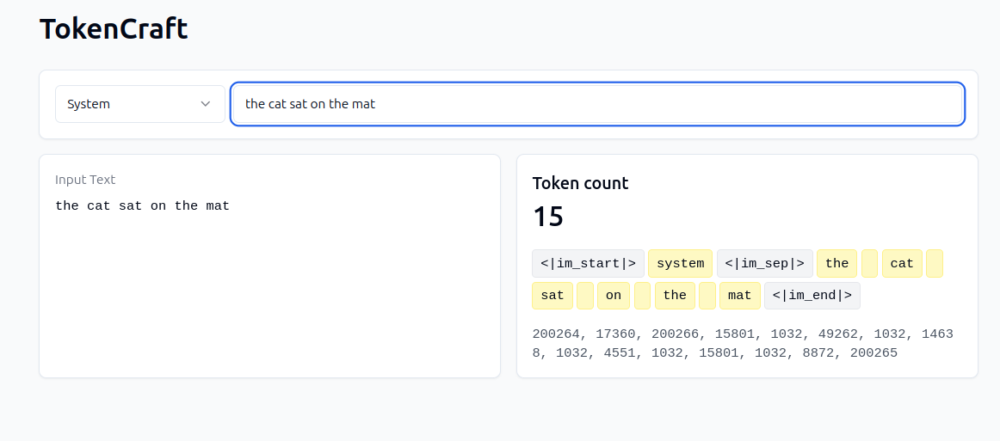

# TokenCraft

A Next.js application for tokenizing text with custom tokenization algorithms. Create your own custom token.



## Features
- Custom text tokenization
- Support for system, user, and assistant message types
- Real-time token visualization
- Token ID generation

## Setup
```bash
# Install dependencies
npm install

# Run development server
npm run dev
```

## Development
The application is built with:
- Next.js 15.2.3
- React 18.3.1
- TypeScript
- Tailwind CSS

## License
ISC

## Contact 
- LinkedIn: [Anant Gabhane](https://www.linkedin.com/in/anantgabhane/)
- X (Twitter): [@AnantGabhane](https://x.com/AnantGabhane)
